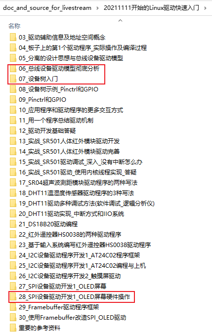
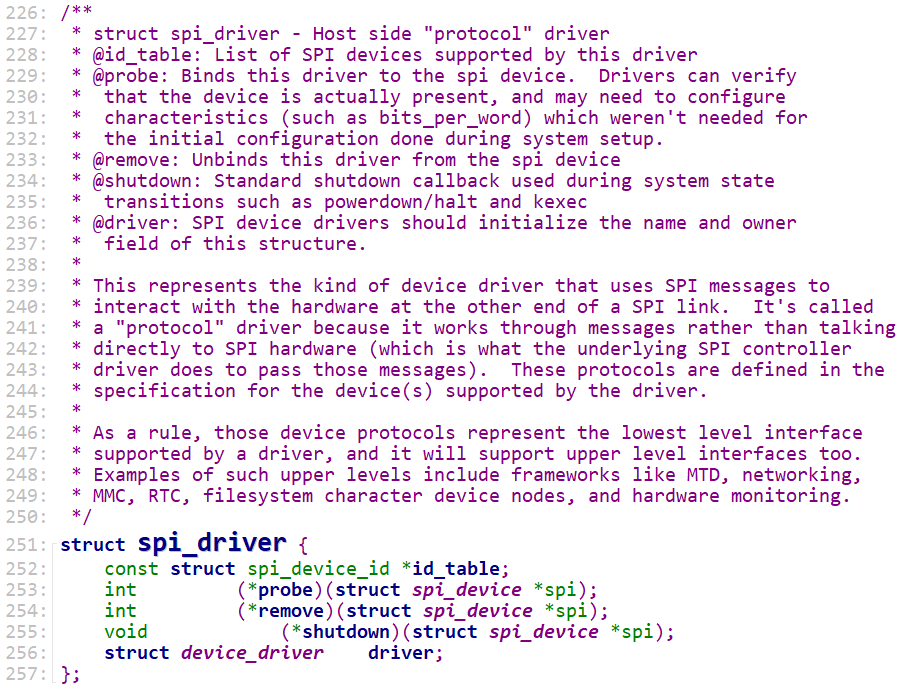

# SPI总线设备驱动模型 #

参考资料：

* 内核头文件：`include\linux\spi\spi.h`

* 百问网驱动直播课里对应的源码
  * GIT仓库：https://e.coding.net/weidongshan/livestream/doc_and_source_for_livestream.git
  * 源码位置：
    
  
* 上述源码也放到了驱动大全的GIT仓库里，位置如下：
  

  

## 1. 回顾平台总线设备驱动模型

Linux驱动程序开始基于"平台总线设备驱动"模型，把驱动程序分成2边：

* 左边注册一个platform_driver结构体，里面是比较固定的、通用的代码

* 右边注册一个platform_device结构体，里面是硬件资源

  * 可以在C文件中注册platform_device
  * 也可以使用设备树创建一个节点，内核解析设备树时注册platform_device

  

## 2. 数据结构

SPI子系统中涉及2类硬件：SPI控制器、SPI设备。

SPI控制器有驱动程序，提供SPI的传输能力。

SPI设备也有自己的驱动程序，提供SPI设备的访问能力：

* 它知道怎么访问这个设备，它知道这个设备的数据含义是什么
* 它会调用SPI控制器的函数来收发数据。

### 2.1 SPI控制器数据结构

参考内核文件：`include\linux\spi\spi.h`

Linux中使用spi_master结构体描述SPI控制器，里面最重要的成员就是`transfer`函数指针：

### 2.2 SPI设备数据结构

参考内核文件：`include\linux\spi\spi.h`

Linux中使用spi_device结构体描述SPI设备，里面记录有设备的片选引脚、频率、挂在哪个SPI控制器下面：

### 2.3 SPI设备驱动

参考内核文件：`include\linux\spi\spi.h`

Linux中使用spi_driver结构体描述SPI设备驱动：

## 3. SPI驱动框架

### 3.1 SPI控制器驱动程序

SPI控制器的驱动程序可以基于"平台总线设备驱动"模型来实现：

* 在设备树里描述SPI控制器的硬件信息，在设备树子节点里描述挂在下面的SPI设备的信息
* 在platform_driver中提供一个probe函数
  * 它会注册一个spi_master
  * 还会解析设备树子节点，创建spi_device结构体

### 3.2 SPI设备驱动程序

跟"平台总线设备驱动模型"类似，Linux中也有一个"SPI总线设备驱动模型"：

* 左边是spi_driver，使用C文件实现，里面有id_table表示能支持哪些SPI设备，有probe函数
* 右边是spi_device，用来描述SPI设备，比如它的片选引脚、频率
  * 可以来自设备树：比如由SPI控制器驱动程序解析设备树后创建、注册spi_device
  * 可以来自C文件：比如使用`spi_register_board_info`创建、注册spi_device

