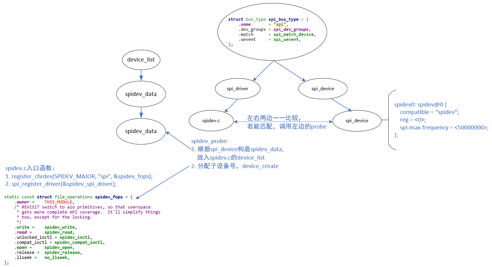
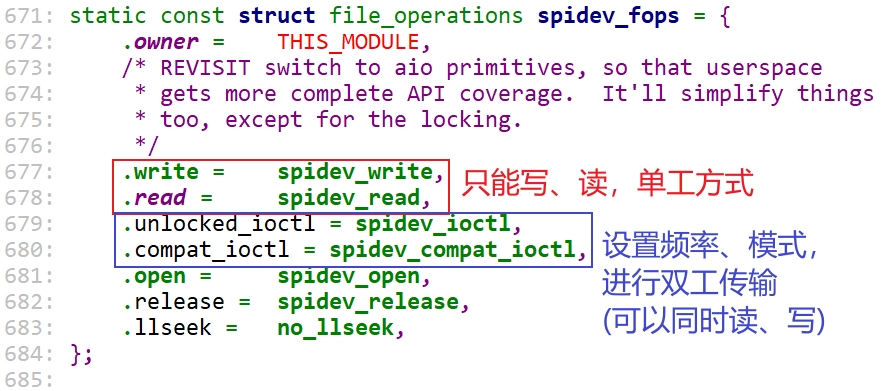
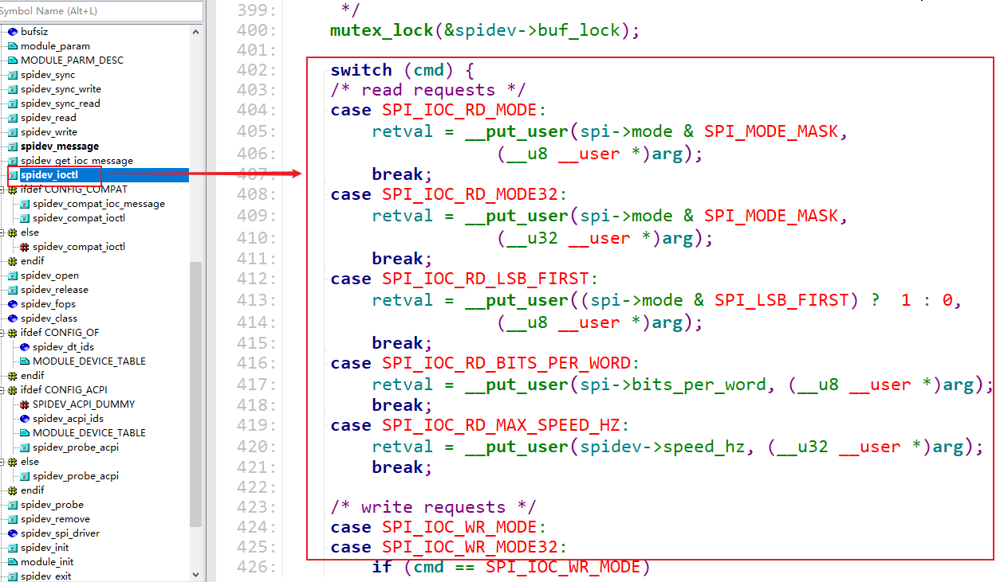
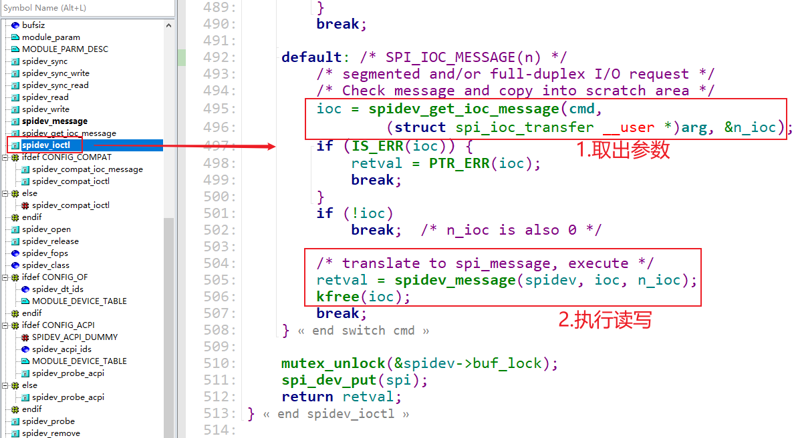
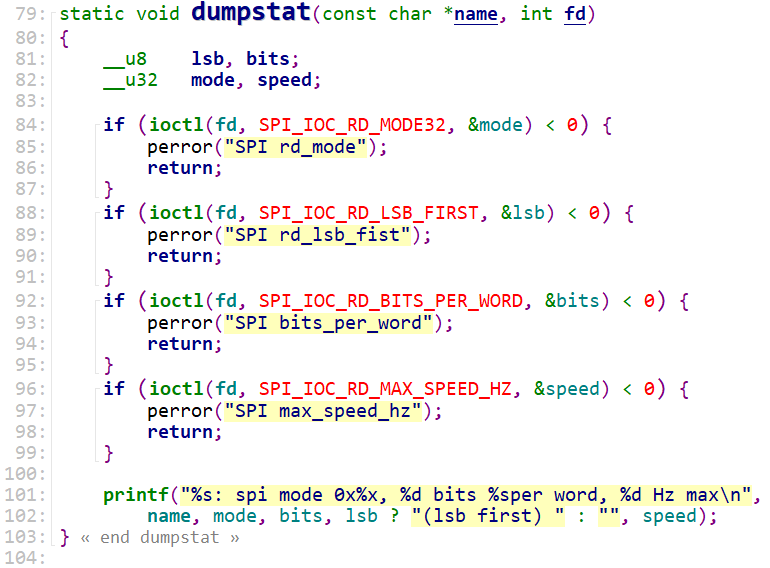
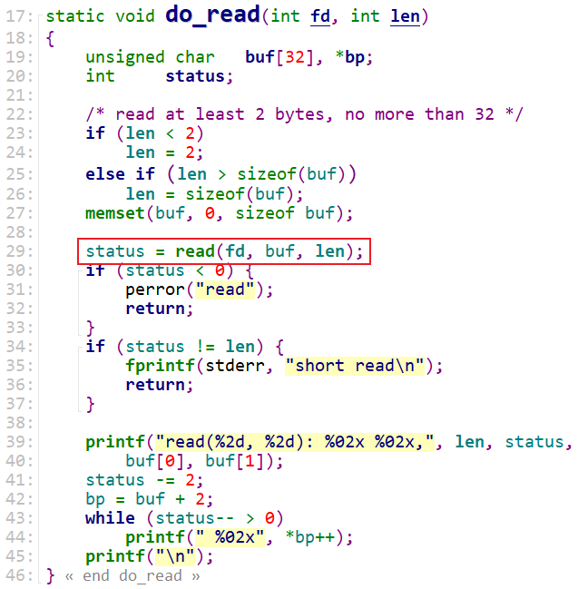
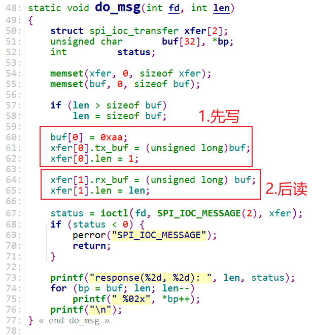
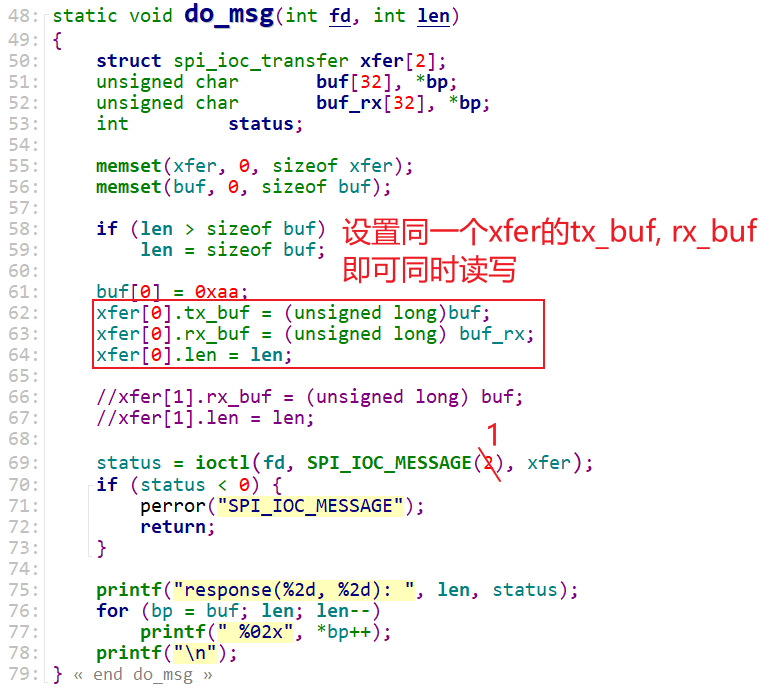

# spidev的使用(SPI用户态API) #

参考资料：

* 内核驱动：`drivers\spi\spidev.c`

* 内核提供的测试程序：`tools\spi\spidev_fdx.c`

* 内核文档：`Documentation\spi\spidev`	

  

## 1. spidev驱动程序分析

内核驱动：`drivers\spi\spidev.c`

### 1.1 驱动框架




设备树示例：

```shell
spidev0: spidev@0 {
    compatible = “spidev”;
    reg = <0>;
    spi-max-frequency = <50000000>;
};
```


设备树里某个spi设备节点的compatible属性等于下列值，就会跟spidev驱动匹配：

* "rohm,dh2228fv"
* "lineartechnology,ltc2488"
* "spidev"


匹配之后，spidev.c的`spidev_probe`会被调用，它会：

* 分配一个spidev_data结构体，用来记录对于的spi_device
* spidev_data会被记录在一个链表里
* 分配一个次设备号，以后可以根据这个次设备号在链表里找到spidev_data
* device_create：这会生产一个设备节点`/dev/spidevB.D`，B表示总线号，D表示它是这个SPI Master下第几个设备


以后，我们就可以通过`/dev/spidevB.D`来访问spidev驱动程序。


### 1.2 驱动程序分析

spidev.c通过file_operations向APP提供接口：




#### 1.2.1 读函数


#### 1.2.2 写函数


#### 1.2.3 通过ioctl读写参数




#### 1.2.4 通过ioclt读写数据




## 2. spidev应用程序分析

内核提供的测试程序：`tools\spi\spidev_fdx.c`

### 2.1 使用方法

```shell
spidev_fdx [-h] [-m N] [-r N] /dev/spidevB.D
```

* -h: 打印用法
* -m N：先写1个字节0xaa，再读N个字节，**注意：**不是同时写同时读
* -r N：读N个字节


### 2.2 代码分析

#### 2.2.1 显示设备属性




#### 2.2.2 读数据



#### 2.2.3 先写再读




#### 2.2.4 同时读写




## 3. spidev的缺点

使用read、write函数时，只能读、写，这是半双工方式。

使用ioctl可以达到全双工的读写。

但是spidev有2个缺点：

* 不支持中断
* 只支持同步操作，不支持异步操作：就是read/write/ioctl这些函数只能执行完毕才可返回

