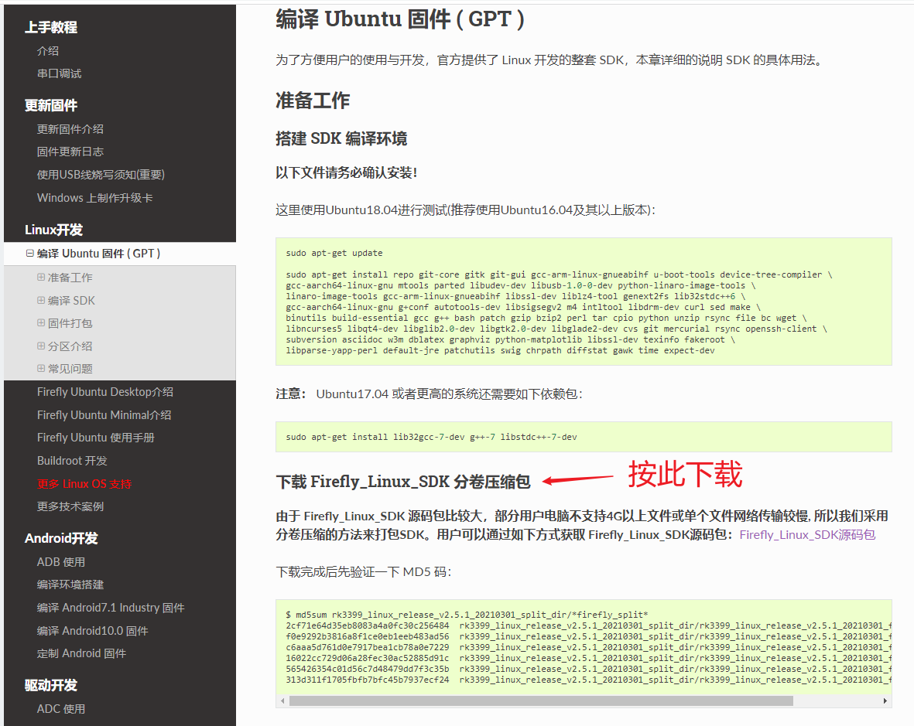
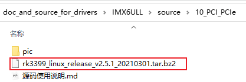

## 1. 官方资料

讲解PCIE时使用的是ROC-RK3399-PC-PLUS/开发板，官方资料地址如下：

https://wiki.t-firefly.com/zh_CN/ROC-RK3399-PC-PLUS/

需要编译内核的话，请根据下图的说明下载源码、编译。如果只是想阅读代码，我们已经事先放在GIT仓库里了。

**注意**：官方提供的内核里面没有`Documentation`目录，我们自己GIT仓库的内核里放入了`Documentation`目录。

## 2. GIT仓库资料说明

学习PCIE视频时，不想动手操作的话只需要阅读源码。

我们已经在GIT仓库里上传了代码。

**注意**：官方提供的内核里面没有`Documentation`目录，我们自己GIT仓库的内核里放入了`Documentation`目录。

内核在GIT仓库如下目录里(为了避免重复存放，内核源码只放在IMX6ULL的目录里)：

