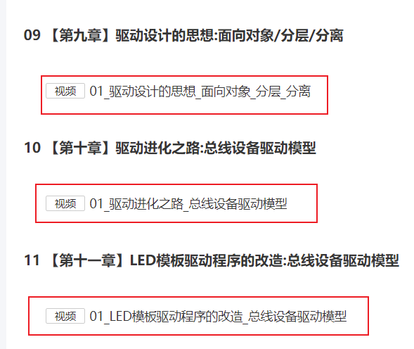
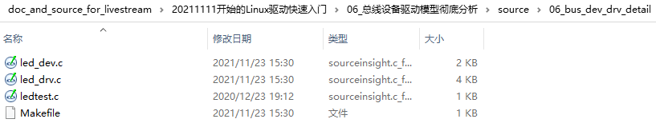

## 总线设备驱动模型彻底分析

Linux在线培训班的预习资料等，放在GIT仓库里。

GIT仓库地址：https://e.coding.net/weidongshan/livestream/doc_and_source_for_livestream.git

GIT使用说明：https://download.100ask.org/tools/Software/git/how_to_use_git.html

**注意**：GIT仓库地址无法在浏览器中直接访问，必须使用GIT工具。

### 1. 预习视频

跟上次课的视频一样：

### 2. 示例代码

代码在GIT仓库中：

### 3. 详细分析

详细分析led_dev.c, led_drv.c中的代码。

