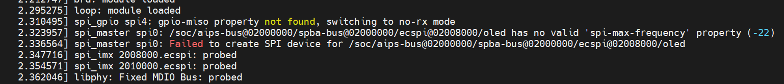

# SPI设备驱动开发1_OLED屏幕硬件操作


## 1.  SPI总线设备驱动模型


## 2. 分析




## 3. 调试DAC驱动

### 3.1 思路

使用逻辑分析仪：发现CS信号没有变化

查看内核调试信息：cat /sys/kernel/debug/gpio, 发现引脚为input：


在内核SPI控制器驱动中添加打印，发现GPIO 122确实被配置为output：

```c
static int spi_imx_setup(struct spi_device *spi)
{
	int err;
	
	dev_dbg(&spi->dev, "%s: mode %d, %u bpw, %d hz\n", __func__,
		 spi->mode, spi->bits_per_word, spi->max_speed_hz);

	if (gpio_is_valid(spi->cs_gpio))
	{
		err =  gpio_direction_output(spi->cs_gpio,
				      spi->mode & SPI_CS_HIGH ? 0 : 1);

	  printk("%s %s %d, spi->cs_gpio = %d, gpio_direction_output, err = %d\n", __FILE__, __FUNCTION__, __LINE__, spi->cs_gpio, err);
	}

	spi_imx_chipselect(spi, BITBANG_CS_INACTIVE);

	return 0;
}
```


怀疑：

* 这个驱动的后续代码再次把GPIO配置成立input
* 其他驱动把GPIO也配置成了input：把spi-imx.ko最后手动加载，发现问题依旧，排除其他驱动的影响。


解决办法：


